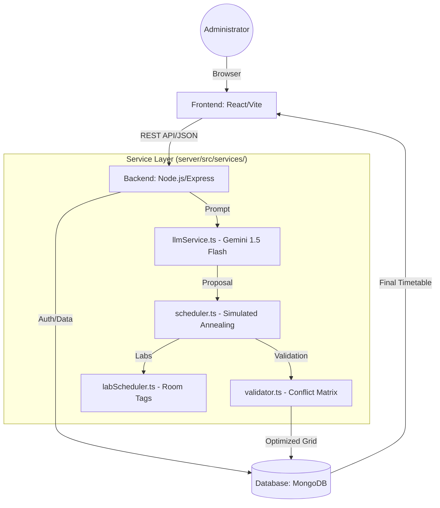

# 🏗️ System Architecture (v4.0.0)

## Overview
The platform follows a MERN-based (MongoDB, Express, React, Node.js) tiered architecture, augmented by a Large Language Model (LLM) service for constraint optimization.

---

## 💾 Data Modeling

The system implements a hierarchical, multi-institution entity structure to ensure domain-specific isolation and relationship integrity.

- **Institution**: The top-level profile (e.g., "Matrusri College").
- **Department**: Academic subdivisions (e.g., "Information Technology", "CME").
- **Teacher**: Faculty members linked to specific departments and an institution.
- **Room**: Physical locations tagged with types and aliases for the optimization engine.
- **Batch**: Student classes grouped by year and semester.
- **Course**: Subject definitions containing credits, required rooms, and faculty mapping.
- **Timetable**: The generated output containing optimized grids and performance metrics.

---

## 🔄 Generation Workflow

The timetable generation cycle is a synchronous API workflow triggered from the frontend Dashboard.

1.  **Request Initialization**:
    The client sends current institution parameters (batches, faculty, rooms) to the `/api/timetables/generate` endpoint.
2.  **LLM Constraint Parsing**:
    `llmService.ts` invokes Gemini 1.5 Flash to convert natural language rules (text) into a structured JSON array of hard/soft constraints.
3.  **Initial Solution Generation**:
    The LLM proposes a "warm start" feasible grid, which is then passed to the `TimetableScheduler` class.
4.  **Local Search Optimization**:
    The `scheduler.ts` runs a **Simulated Annealing** loop (N-1 move and N-2 swap operators) for 1000 iterations to reduce gap penalties and balance day loads.
5.  **Matrix Verification**:
    Every move is verified in $O(1)$ time by the `ConflictMatrix` in `validator.ts`. This represents a significant optimization over traditional $O(N)$ scanning where $N$ is the total number of events, allowing for complex multi-departmental grids (IT, CME) to be solved simultaneously.
6.  **Persistence & Response**:
    The final optimized grid is saved as a `Timetable` object. We utilize **MongoDB's Document Model** to store these sparse matrices as nested BSON objects, providing significantly faster retrieval and schema flexibility compared to rigid JOIN-heavy SQL relational tables—essential for handling unpredictable institutional grid shapes.

---

## 🛠️ Technology Stack

- **Frontend**: 
    - React 19 (Hooks, Context API)
    - Tailwind CSS 4 (Glassmorphic Design System)
    - Vite 6 (Optimized React Bundling)
- **Backend**:
    - Node.js (v20+)
    - Express 5 (REST API Layer)
    - Mongoose 8 (MongoDB ODM)
    - ts-node-dev (TypeScript Runtime)
- **AI Integration**:
    - Google Generative AI (`@google/generative-ai`)
    - **Gemini 1.5 Flash** (Large Language Model)
- **Database**:
    - MongoDB Atlas (Cloud-hosted DB)

---

## 🎨 Professional UI Design System

The application employs a custom styling system defined in `index.css` and `client/src/App.tsx`, focusing on:

- **Glassmorphism**: Backdrop blur effects (e.g., `bg-slate-900/80 backdrop-blur-xl`).
- **Dynamic Legend**: Interactive "Subject Legend" highlighting faculty mappings for each batch.
- **Responsive Layouts**: Multi-tab navigation for viewing schedules across different sets of batches and departments.

---
**Version:** 4.0.0 (Research Edition)  
**Date:** March 30, 2026
