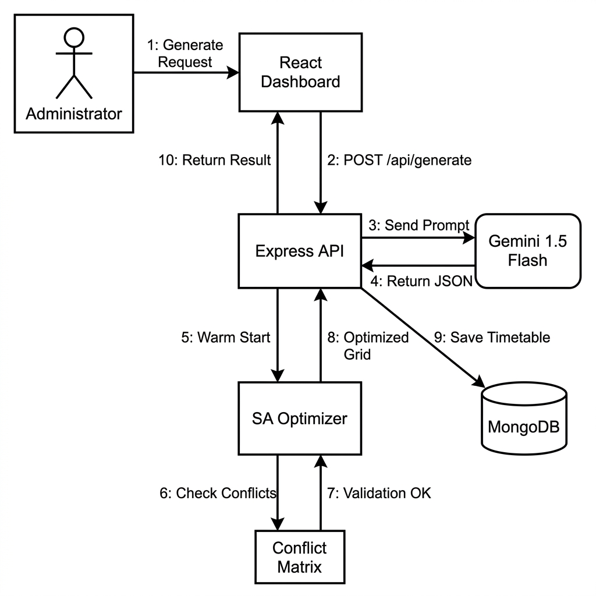
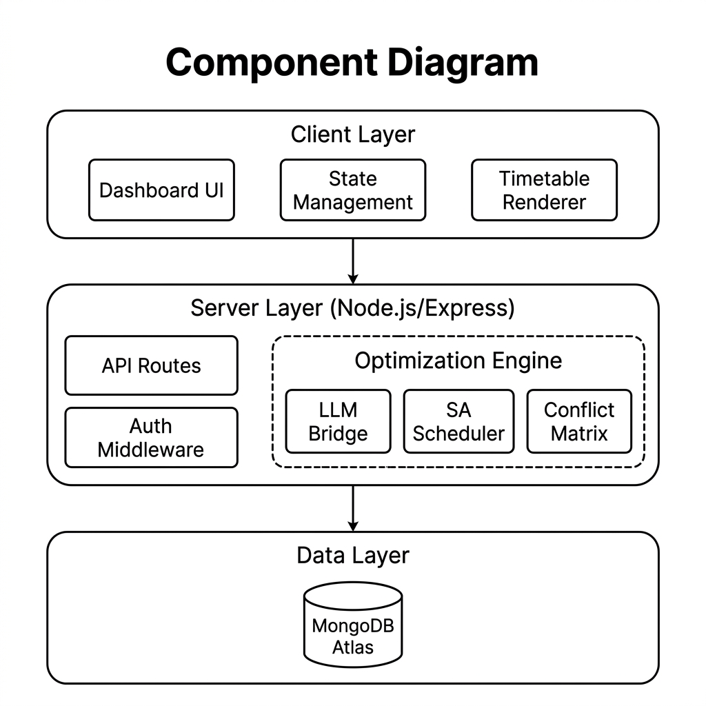
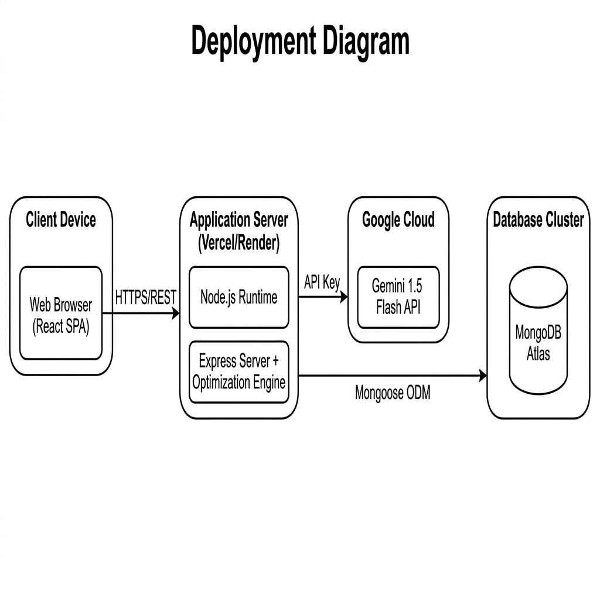

# 📚 Automated Timetable Scheduler (Research Edition)


[](https://github.com/AbhiramRavula/automated-timetable-scheduler)
[](https://github.com/AbhiramRavula/automated-timetable-scheduler)

A high-performance, web-based platform for academic institutions to automate the complex task of timetable scheduling using **LLM-Augmented Constraint Optimization**.

## 🚀 Key Features

- **🧠 Hybrid AI Engine**: Combines **Gemini 1.5 Flash** for natural language constraint parsing with **Simulated Annealing** for rigorous mathematical optimization.
- **⚡ Advanced Optimization**: Employs **N-1 (Move)** and **N-2 (Swap)** operators with $O(1)$ matrix conflict detection.
- **🏢 Multi-Institution Support**: Manage multiple college profiles with isolated data and custom room tags.
- **🔬 Smart Lab Scheduling**: Automated batch splitting and tag-based room aliasing for specialized laboratory resources.
- **📊 Faculty Workload Insights**: Real-time aggregation of teaching hours and balanced distribution across departments.
- **✨ Premium UI/UX**: Professional dashboard with dark-mode glassmorphism and interactive timetable grids.

## ⚙️ How It Works

The platform solves the complex University Course Timetabling Problem (UCTP) using a **three-phase hybrid architecture**:

1.  **Data Input & Setup**: Administrators define the institution's metadata, including faculty profiles, subjects (lectures and labs), class batches, and physical rooms.
2.  **Phase 1: Intelligent Initialization (LLM-Augmented)**: Natural language constraints (e.g., "Professor X only teaches in the morning") are processed by **Gemini 1.5 Flash**. The LLM translates these textual rules into structured parameters and proposes an initial, "warm start" feasible grid.
3.  **Phase 2: Local Search Optimization (Simulated Annealing)**: The core metaheuristic optimization engine takes over. It rapidly explores alternative schedules using **N-1 (Move)** and **N-2 (Swap)** operators. Guided by a geometric cooling schedule, it iteratively minimizes soft constraint penalties (like gap and balance scores) while strictly adhering to hard constraints.
4.  **Phase 3: Hardware Verification**: A specialized $O(1)$ `ConflictMatrix` handles collision detection in constant time. This allows the system to validate thousands of potential schedules per second, ensuring zero overlapping classes, mandatory lunch breaks, and correct lab equipment allocation.
5.  **Output & Visualization**: The fully optimized timetable is finalized, filling empty slots with extracurriculars (Library/Sports), and presented on an interactive React dashboard.

## 📁 Repository Structure

- `client/`: React/Vite/TypeScript frontend.
- `server/`: Node.js/Express/MongoDB backend.
- `RESEARCH_THESIS.md`: Full academic paper documentation.
- `TECHNICAL_SPECIFICATIONS.md`: Deep dive into APIs and Models.
- `ARCHITECTURE.md`: System design and data flow.
- `ALGORITHM_SUMMARY.md`: In-depth logic of the scheduling engine.

## 🛠️ Tech Stack

- **Frontend**: React 19, Tailwind CSS 4, Vite 6.
- **Backend**: Node.js, Express 5, Mongoose 8.
- **AI**: Google Generative AI (Gemini 1.5 Flash).
- **Database**: MongoDB (Atlas).

## 📐 System Design (UML)

### Collaboration Diagram
Visualizes the flow of messages between system components during timetable generation.



### Component Diagram
Illustrates the structural relationship between software modules.



### Deployment Diagram
Shows the physical distribution of the application across cloud nodes.



## 🏁 Getting Started

1.  **Clone & Install**:
    ```bash
    git clone https://github.com/AbhiramRavula/automated-timetable-scheduler
    cd automated-timetable-scheduler
    # Follow instructions in SETUP.md
    ```
2.  **Environment Setup**:
    Configure your `.env` in the `server/` directory with your `GEMINI_API_KEY`.
3.  **Seed Data**:
    ```bash
    cd server
    npx ts-node src/seed.ts
    ```

## 📄 Documentation

For full research details, please refer to the [RESEARCH_THESIS.md](./RESEARCH_THESIS.md).

---
**Status:** ✅ Production Ready  
**Institutional Partner:** Matrusri Engineering College  
**Lead Architect:** Abhiram Ravula
