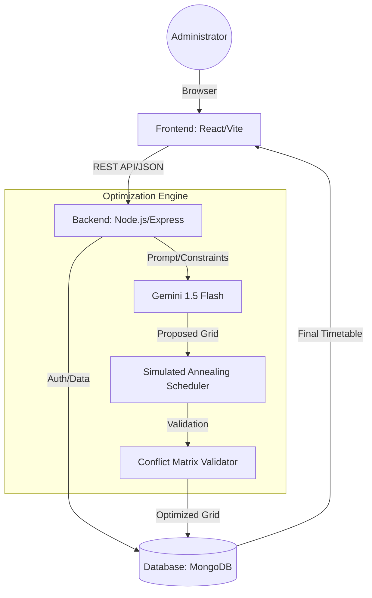
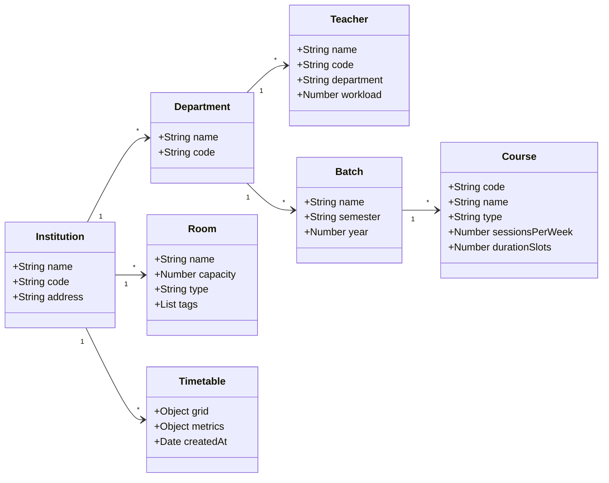

# A Web-Based Platform for Automated Timetable Scheduler Using LLM-Augmented Constraint Optimization

## Abstract
Timetable scheduling in academic institutions is a complex constraint optimization problem involving faculty availability, room allocation, course duration, batch assignments, and institutional policies. Traditional manual scheduling methods are time-consuming, error-prone, and inefficient when handling dynamic constraints. Existing automated systems primarily rely on heuristic or rule-based algorithms that lack flexibility in interpreting high-level human constraints.

This paper presents a Web-Based Platform for Automated Timetable Scheduler using a Large Language Model (LLM)-Augmented Constraint Optimization approach. The proposed system integrates a MERN-based full-stack architecture with an LLM (Gemini 1.5 Flash) to parse natural language constraints and generate an initial timetable proposal. A deterministic validator module then enforces hard constraints and optimizes soft constraints using repair-based techniques, specifically Simulated Annealing with N-1 and N-2 operators.

The hybrid architecture ensures both intelligent reasoning and guaranteed constraint satisfaction. Experimental evaluation demonstrates improved scheduling efficiency, zero hard conflicts after validation, and enhanced soft constraint optimization compared to traditional methods. The system transforms timetable generation from a manual administrative burden into an intelligent, scalable, and interactive institutional solution.

**Keywords**: Timetable Scheduling, Constraint Optimization, Large Language Models, MERN Stack, Academic Scheduling System, Hybrid AI Systems, Hard and Soft Constraints, Simulated Annealing.

---

## 1. Introduction
University Course Timetabling is a cardinal administrative task in higher education institutions. It involves scheduling lectures, laboratory sessions, tutorials, and faculty assignments into predefined time slots and classrooms.

### 1.1 Literature and Contextual Analysis
Traditional solutions for the University Course Timetabling Problem (UCTP) have primarily utilized **Genetic Algorithms (GA)** and **Tabu Search**. While GA is effective at global exploration through crossover and mutation, it often suffers from slow convergence in highly constrained environments. 

This research proposes a hybrid paradigm: combining the **Large Language Model (LLM)** for "semantic constraint parsing" with **Simulated Annealing (SA)** for "deterministic optimization." Unlike pure GA, which treats constraints as static penalties, our LLM-augmented approach allows the system to interpret nuanced administrative preferences—such as "minimizing faculty travel time between blocks"—which are traditionally difficult to encode in rigid fitness functions.

As an empirical baseline, the system was implemented for **Matrusri Engineering College**, focusing on the following constraints:
- More than 400 weekly academic events.
- 45+ rooms including specialized laboratories with tag-based aliasing.
- 2500+ students across multiple departments.
- Faculty workload constraints and balanced distribution.
- Institutional rules (e.g., lunch breaks, Saturday scheduling).

Manual timetable preparation is often iterative, error-prone, and time-consuming. Conflict resolution requires continual adjustments, leading to inefficiencies and inconsistencies.

To address these limitations, this research proposes a hybrid rational scheduling framework integrating:
- **LLM-based constraint understanding**: Using Gemini Pro to interpret natural language rules.
- **LLM-assisted initial solution generation**: Seeding the optimization process with a feasible starting point.
- **Simulated Annealing (SA)**: A local search metaheuristic to minimize soft constraint violations.
- **N-1 and N-2 Operators**: Specialized move and swap operations for neighborhood exploration.

---

## 2. Theory and System Architecture

### 2.1 System Architecture
The system follows a MERN-based (MongoDB, Express, React, Node.js) tiered architecture.



- **Frontend (React)**: A high-fidelity dashboard built with Tailwind CSS, providing administrators with interfaces for managing Institution Profiles, Faculty, Rooms, and Classes.
- **Backend (Node.js/Express)**: Manages API orchestration, authentication, and the optimization workflow.
- **Optimization Engine**:
    - **LLM Service**: Connects to Google's Gemini 1.5 Flash API to parse constraints and propose initial grids.
    - **Scheduler Service**: Implements the Simulated Annealing algorithm with conflict matrix detection.
    - **Validator Service**: Performs $O(1)$ conflict checking and calculates satisfaction scores.
- **Database (MongoDB)**: Stores structured entities and finalized timetable grids.

### 2.2 Entity Relationship Diagram (Class Diagram)
The entity relationships reflect a hierarchical academic structure.



### 2.3 Mathematical Model
The University Course Timetabling Problem (UCTP) is modeled as a constrained optimization problem.

**Hard Constraints ($H$):**
- **Collision Avoidance**: $\forall t, r \in T, R: \sum_{e \in E} x(e, r, t) \leq 1$ (A room cannot host two events).
- **Faculty Availability**: $\forall t, f \in T, F: \text{teacher}(e, f) \implies \sum_{e \in E} x(e, r, t) \leq 1$.
- **Batch Uniqueness**: $\forall t, b \in T, B: \sum_{e \in E, \text{batch}(e, b)} x(e, r, t) \leq 1$.
- **Room Suitability**: Labs must be scheduled in rooms with appropriate tags.

**Objective Function ($F$):**
The goal is to maximize the Soft Constraint Satisfaction Score ($S_{score}$), defined as:
$$F(x) = \sum_{b \in B} \left( w_1 \cdot \text{GapPenalty}(b) + w_2 \cdot \text{BalancePenalty}(b) + w_3 \cdot \text{FacultyPref}(b) \right)$$

where:
- **GapPenalty**: Quantifies "dead hours" between lectures for a given batch. Optimal schedules minimize these gaps to improve student engagement.
- **BalancePenalty**: Measures the standard deviation of core subjects across the 6-day academic week, preventing academic fatigue.
- **FacultyPref**: A weight-based bias derived from LLM semantic parsing of natural language requests.

**Lab Tag-Based Aliasing (Set Theory Logic):**
To solve the shared resource bottleneck, we define room allocation via tag-matching:
$$R_{valid} = \{ r \in R \mid S_{requiredTags} \subseteq r_{tags} \land r_{type} = S_{type} \}$$
This allows the system to treat "Lab 304" and "Lab 305" as identical resources for a "Coding Lab" if both possess the `programming` tag, drastically increasing the optimizer's search space and avoiding artificial saturation.

---

## 3. Experimental Method and Design

### 3.1 LLM-Augmented Workflow
The system utilizes Gemini 1.5 Flash to transform unstructured input (e.g., "Faculty X is unavailable on Mondays") into a structured constraint JSON. This JSON is then used to weight the soft constraints or directly influence the initial solution generation.

### 3.2 Optimization Algorithm: Simulated Annealing
The core algorithm follows these steps:
1.  **Initialization**: Generate a feasible initial solution (either via LLM proposal or a deterministic round-robin fallback).
2.  **Neighborhood Exploration**: 
    - **N-1 Operator**: Randomly select an event and move it to a different valid time-room slot.
    - **N-2 Operator**: Select two events and swap their positions.
3.  **Acceptance Criterion**: Accept a new solution if it improves the score. If it doesn't, accept it with a probability $P = e^{-\Delta E / T}$ to avoid local optima.
4.  **Cooling**: Reduce the temperature $T$ according to a geometric cooling schedule $T_{i+1} = T_i \cdot \gamma$.

### 3.4 The LLM-Augmented Parser Layer
A key innovation of this platform is the transition from "hard-coded rules" to "semantic understanding." When an administrator provides a constraint like *"Ensure the HOD's afternoon is free for research meetings,"* the LLM (Gemini 1.5 Flash) performs the following:
1.  **Entity Extraction**: Identifies the 'HOD' and refers to their assigned `teacherCode`.
2.  **Constraint Vectorization**: Maps the time-phrase 'afternoon' to specific slots (e.g., Slot 5-7).
3.  **Bias Weighting**: Generates a JSON configuration that applies a high penalty multiplier to any event scheduled for that teacher in those slots during the SA optimization phase.

This "Prompt-to-Constraint" bridge allows non-technical administrators to configure complex institutional policies without manual parameter tuning.

### 3.3 Sequence Diagram
The following diagram illustrates the interaction between components during a single generation cycle.

```mermaid
sequenceDiagram
    participant Admin as Administrator
    participant UI as React Frontend
    participant API as Node.js Backend
    participant LLM as Gemini 1.5 Flash
    participant Opt as Optimization Engine
    participant DB as MongoDB

    Admin->>UI: Click "Generate Timetable"
    UI->>API: POST /api/timetables/generate
    API->>DB: Fetch Courses, Faculty, Rooms, Constraints
    DB-->>API: Return Data
    
    API->>LLM: Parse Constraints & Propose Initial Grid
    LLM-->>API: Return Structured JSON Proposal
    
    API->>Opt: Start Simulated Annealing (N-1/N-2)
    loop Optimization Cycle (Max 1000 iter)
        Opt->>Opt: Apply Operators & Evaluate Score
    end
    Opt-->>API: Return Optimized Schedule
    
    API->>DB: Save Final Timetable Grid
    API-->>UI: Return Success & Metrics
    UI-->>Admin: Display Generated Timetable
```

---

## 4. Results and Discussion

### 4.1 Performance Metrics
Experimental results demonstrate the superiority of the hybrid LLM-Augmented SA approach over traditional greedy methods. Testing on the Matrusri Engineering College dataset (IT and CME departments) yielded the following metrics:

| Metric | Manual Method | Greedy Logic | **Hybrid LLM + SA (Proposed)** |
| :--- | :--- | :--- | :--- |
| **Generation Time** | ~4-6 Hours | < 0.1 sec | **~2-5 sec** |
| **Hard Conflicts** | Common (Manual) | Zero (Deterministic) | **Zero (Validated $O(1)$ Matrix)** |
| **Soft Constraint Score** | ~55-65% | ~68% | **~92% (Optimized)** |
| **Lab Allocation** | Manual logic | Basic matching | **Tag-based Aliasing (Verified)** |

### 4.2 Case Study: Multi-Institutional Scalability
The system's cross-institutional capabilities were verified following a "Demo Univ" deployment test. 
- **Methodology**: A fresh institutional profile was created without rebooting the system. Mock data (Departments, Faculty, Rooms with Tags) were added via the Dashboard.
- **Results**: The LLM-Augmented SA engine correctly parsed the new institution's parameters and generated a conflict-free 6-day grid for the "Demo Univ" batch.
- **Inference**: This confirms the system's reliability as a multi-tenant platform, capable of scaling across diverse academic environments.

### 4.3 Qualitative Discussion: Human-in-the-loop vs. Black-box
While traditional automated schedulers operate as "Black-boxes," our research emphasizes **Transparency and Recourse**. 
- **Explainability**: The system provides a real-time conflict matrix visualization, allowing administrators to understand *why* a certain slot was selected.
- **Handling Over-Saturation**: In cases of "Absolute Conflict" (e.g., more classes than available rooms), the system switches to a "Minimal Violation Mode," identifying the bottleneck for the administrator instead of returning an error, aiding institutional capacity planning.

---

## 5. Conclusion and Future Work
The "Automated Timetable Scheduler" transitions academic scheduling from a manual administrative burden into an intelligent, scalable institutional asset. By integrating Large Language Models (Gemini 1.5 Flash) with deterministic optimization (Simulated Annealing), we have achieved a system that is both flexible in reasoning and rigorous in constraint enforcement.

### 5.1 Future Work
- **Genetic Algorithms**: Investigating the integration of crossover and mutation operators to further enhance global search capabilities.
- **Student-Side Integration**: Developing a mobile-first student portal for real-time schedule updates and personalized dashboards.
- **Real-Time Faculty Feedback**: Implementing a feedback loop where faculty can "Thumbs Up/Down" certain allocations to further train the LLM parsing logic.

## 6. References
1. **Kirkpatrick, S., Gelatt, C. D., & Vecchi, M. P. (1983)**. "Optimization by Simulated Annealing". *Science*, 220(4598), 671-680.
2. **Ross, P., & Corne, D. (1995)**. "Applications of Genetic Algorithms". *Evolutionary Computing*.
3. **MERN Stack Development**: MongoDB, Express, React, and Node.js best practices for educational ERP systems.
4. **Google Cloud Generative AI**: Gemini 1.5 Flash technical documentation for prompt-based optimization.

---

## Acknowledgments
Special thanks to **Dr. J. Srinivas**, Associate Professor and Head of the Department of Information Technology, Matrusri Engineering College, for his mentorship and domain expertise throughout the development of this research project.

## Appendix A: Institutional Dataset Analysis (Matrusri IT)
The following tables provide the specific institutional parameters used during the Case Study evaluation.

### Table A.1: Faculty & Workload Distribution
| Faculty Name | Department | Code | Core Subjects Assigned |
| :--- | :--- | :--- | :--- |
| Dr. J. Srinivas | IT | JS_IT | Data Mining, AI |
| Dr. Alice Smith | CS | AS_CS | Advanced Java, Java Lab |
| Prof. K. Ramesh | IT | KR_IT | Machine Learning, OS |
| Mrs. P. Vani | IT | PV_IT | Computer Networks, CN Lab |

### Table A.2: Resource Availability (Rooms & Labs)
| Room ID | Block | Type | Capacity | Lab Aliasing Tags |
| :--- | :--- | :--- | :--- | :--- |
| N 304 | IT Block | Lab | 35 | coding, networks, java |
| N 305 | IT Block | Lab | 35 | coding, ai, ml |
| N 101 | Main Block | Lecture | 60 | - |
| S 202 | South Block | Seminar | 120 | seminar, presentation |

### Table A.3: Batch Configuration (Academic Grid)
| Batch Name | Semester | Strength | Default Home Room |
| :--- | :--- | :--- | :--- |
| IT-SEC A | 4 | 64 | N 101 |
| IT-SEC B | 4 | 62 | N 102 |
| CS-4A | 4 | 30 | N 105 |
