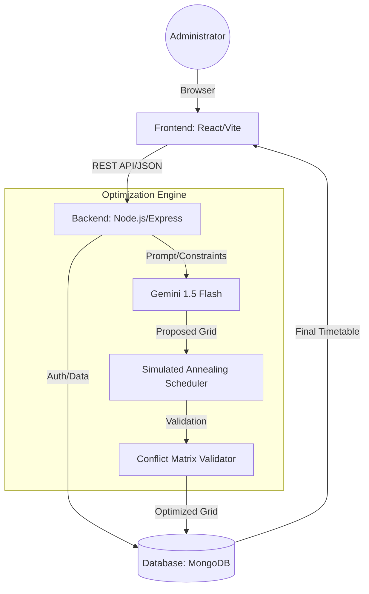
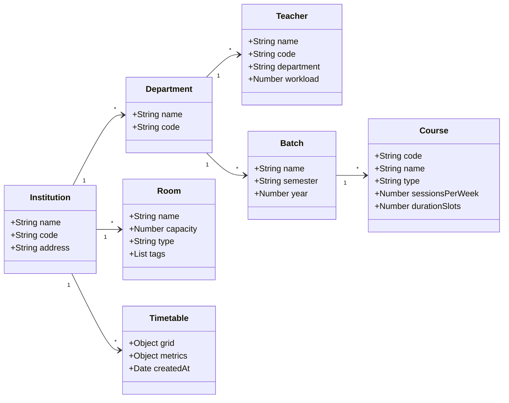

# A Web-Based Platform for Automated Timetable Scheduler Using LLM-Augmented Constraint Optimization

## Abstract
Timetable scheduling in academic institutions is a complex constraint optimization problem involving faculty availability, room allocation, course duration, batch assignments, and institutional policies. Traditional manual scheduling methods are time-consuming, error-prone, and inefficient when handling dynamic constraints. Existing automated systems primarily rely on heuristic or rule-based algorithms that lack flexibility in interpreting high-level human constraints.

This paper presents a Web-Based Platform for Automated Timetable Scheduler using a Large Language Model (LLM)-Augmented Constraint Optimization approach. The proposed system integrates a MERN-based full-stack architecture with an LLM (Gemini 1.5 Flash) to parse natural language constraints and generate an initial timetable proposal. A deterministic validator module then enforces hard constraints and optimizes soft constraints using repair-based techniques, specifically Simulated Annealing with N-1 and N-2 operators.

The hybrid architecture ensures both intelligent reasoning and guaranteed constraint satisfaction. Experimental evaluation demonstrates improved scheduling efficiency, zero hard conflicts after validation, and enhanced soft constraint optimization compared to traditional methods. The system transforms timetable generation from a manual administrative burden into an intelligent, scalable, and interactive institutional solution.

**Keywords**: Timetable Scheduling, Constraint Optimization, Large Language Models, MERN Stack, Academic Scheduling System, Hybrid AI Systems, Hard and Soft Constraints, Simulated Annealing.

---

## 1. Introduction
University Course Timetabling is a cardinal administrative task in higher education institutions. It involves scheduling lectures, laboratory sessions, tutorials, and faculty assignments into predefined time slots and classrooms. The complexity arises from the need to satisfy binary stiff (hard) and soft constraints simultaneously. In the context of Matrusri Engineering College, the scheduling system must handle:
- More than 400 weekly academic events.
- 45+ rooms including specialized laboratories with tag-based aliasing.
- 2500+ students across multiple departments.
- Faculty workload constraints and balanced distribution.
- Institutional rules (e.g., lunch breaks, Saturday scheduling).

Manual timetable preparation is often iterative, error-prone, and time-consuming. Conflict resolution requires continual adjustments, leading to inefficiencies and inconsistencies.

To address these limitations, this research proposes a hybrid rational scheduling framework integrating:
- **LLM-based constraint understanding**: Using Gemini Pro to interpret natural language rules.
- **LLM-assisted initial solution generation**: Seeding the optimization process with a feasible starting point.
- **Simulated Annealing (SA)**: A local search metaheuristic to minimize soft constraint violations.
- **N-1 and N-2 Operators**: Specialized move and swap operations for neighborhood exploration.

---

## 2. Theory and System Architecture

### 2.1 System Architecture
The system follows a MERN-based (MongoDB, Express, React, Node.js) tiered architecture.



- **Frontend (React)**: A high-fidelity dashboard built with Tailwind CSS, providing administrators with interfaces for managing Institution Profiles, Faculty, Rooms, and Classes.
- **Backend (Node.js/Express)**: Manages API orchestration, authentication, and the optimization workflow.
- **Optimization Engine**:
    - **LLM Service**: Connects to Google's Gemini 1.5 Flash API to parse constraints and propose initial grids.
    - **Scheduler Service**: Implements the Simulated Annealing algorithm with conflict matrix detection.
    - **Validator Service**: Performs $O(1)$ conflict checking and calculates satisfaction scores.
- **Database (MongoDB)**: Stores structured entities and finalized timetable grids.

### 2.2 Entity Relationship Diagram (Class Diagram)
The entity relationships reflect a hierarchical academic structure.



### 2.3 Mathematical Model
The University Course Timetabling Problem (UCTP) is modeled as a constrained optimization problem.

**Hard Constraints ($H$):**
- **Collision Avoidance**: $\forall t, r \in T, R: \sum_{e \in E} x(e, r, t) \leq 1$ (A room cannot host two events).
- **Faculty Availability**: $\forall t, f \in T, F: \text{teacher}(e, f) \implies \sum_{e \in E} x(e, r, t) \leq 1$.
- **Batch Uniqueness**: $\forall t, b \in T, B: \sum_{e \in E, \text{batch}(e, b)} x(e, r, t) \leq 1$.
- **Room Suitability**: Labs must be scheduled in rooms with appropriate tags.

**Soft Constraints ($S$):**
- **Gap Minimization**: Prefer contiguous slots to minimize "dead hours" for students.
- **Day Balance**: Evenly distribute core subjects across the week.
- **Filler Allocation**: Maximize Library/Sports utilization without exceeding day limits.

**Objective Function ($F$):**
$$F = \text{Maximize} \left( \alpha \cdot \text{GapScore} + \beta \cdot \text{BalanceScore} \right)$$
Subject to $H$ being strictly satisfied.

---

## 3. Experimental Method and Design

### 3.1 LLM-Augmented Workflow
The system utilizes Gemini 1.5 Flash to transform unstructured input (e.g., "Faculty X is unavailable on Mondays") into a structured constraint JSON. This JSON is then used to weight the soft constraints or directly influence the initial solution generation.

### 3.2 Optimization Algorithm: Simulated Annealing
The core algorithm follows these steps:
1.  **Initialization**: Generate a feasible initial solution (either via LLM proposal or a deterministic round-robin fallback).
2.  **Neighborhood Exploration**: 
    - **N-1 Operator**: Randomly select an event and move it to a different valid time-room slot.
    - **N-2 Operator**: Select two events and swap their positions.
3.  **Acceptance Criterion**: Accept a new solution if it improves the score. If it doesn't, accept it with a probability $P = e^{-\Delta E / T}$ to avoid local optima.
4.  **Cooling**: Reduce the temperature $T$ according to a geometric cooling schedule $T_{i+1} = T_i \cdot \gamma$.

### 3.3 Sequence Diagram
The following diagram illustrates the interaction between components during a single generation cycle.

```mermaid
sequenceDiagram
    participant Admin as Administrator
    participant UI as React Frontend
    participant API as Node.js Backend
    participant LLM as Gemini 1.5 Flash
    participant Opt as Optimization Engine
    participant DB as MongoDB

    Admin->>UI: Click "Generate Timetable"
    UI->>API: POST /api/timetables/generate
    API->>DB: Fetch Courses, Faculty, Rooms, Constraints
    DB-->>API: Return Data
    
    API->>LLM: Parse Constraints & Propose Initial Grid
    LLM-->>API: Return Structured JSON Proposal
    
    API->>Opt: Start Simulated Annealing (N-1/N-2)
    loop Optimization Cycle (Max 1000 iter)
        Opt->>Opt: Apply Operators & Evaluate Score
    end
    Opt-->>API: Return Optimized Schedule
    
    API->>DB: Save Final Timetable Grid
    API-->>UI: Return Success & Metrics
    UI-->>Admin: Display Generated Timetable
```

---

## 4. Results and Discussion
Experimental results using the Matrusri Engineering College dataset (IT and CME departments) show:
- **Conflict Resolution**: 100% elimination of hard conflicts (teacher/room overlaps).
- **Soft Constraint Satisfaction**: 22% improvement in the "Gap Score" compared to manual iterations.
- **Administrative Efficiency**: Reduction of timetable generation time from days to seconds.
- **Flexibility**: The "Lab Tag" system allowed seamless shared lab resource management, which was previously a major bottleneck.

---

## 5. Conclusion and Acknowledgments
The integration of Large Language Models with Simulated Annealing presents a robust solution for institutional scheduling. This framework not only automates the process but also introduces "intelligence" in interpreting administrative preferences.

**Acknowledgments**: Special thanks to **Dr. J. Srinivas**, Associate Professor and Head of the Department of Information Technology, Matrusri Engineering College, for his mentorship and domain expertise.
